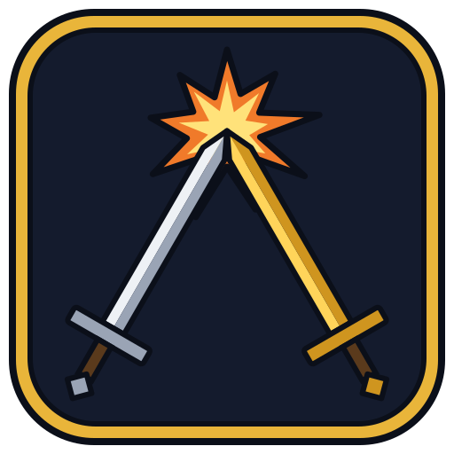

# DuelElo

  
  
  

**Ranked dueling for WoW Forever.** DuelElo tracks every duel you fight and,
when your opponent also has DuelElo, lets you both agree to a **ranked** duel
with a rating, placement games, ranks and a League-style results screen.

Install it and duel. That's it — no setup.

## Features

- **Automatic duel tracking** — every win and loss, who you fought, their class,
  whether someone fled, where and how long. Works against anyone, addon or not.
- **Ranked duels** — if your opponent has DuelElo, a small *Ranked / Casual*
  prompt appears when the duel is requested. It's ranked only if you both agree
  **before** the fight starts — nobody can back out after losing.
- **Rating and ranks** — a Glicko-2 rating (shown as an *estimate* until the
  official ladder confirms it), 10 placement games, then a rank from
  **Combatant → Challenger → Rival → Duelist → Elite**, with divisions IV–I.
  Ranks use WoW's own rated-PvP icons.
- **Results screen** — VICTORY / DEFEAT, your rank emblem, an animated rating
  bar and promotion / demotion banners. Drag it anywhere; resize it in options.
- **Leaderboard** — every DuelElo player on your realm, shared automatically in
  the background. Gold elite dragons for the top 10, silver for the top 100 and a
  crown for #1. Ratings you haven't verified by dueling that player are marked.
- **Fair play** — see *Ranked rules* below. Spot something shady? Report the duel
  from the results screen or your History.
- **Rank widget** — a small, stream-friendly panel with your rank, recent results
  and rating trend (Full / Compact / Minimal). Off by default: `/duelelo widget show`.
- **Lightweight** — no libraries, nothing runs in the background, no art to load.

## Using it

| | |
|---|---|
| `/duelelo` | Open your record, leaderboard and stats |
| `/duelelo options` | Settings (also in *Settings → AddOns → DuelElo*) |
| `/duelelo setup` | The setup guide (it also opens once after your first login) |
| `/duelelo ranked always\|ask\|never` | How to answer ranked requests |
| `/duelelo cooldowns on\|off` | Wait for cooldowns: ranked only once both players' trinkets and long cooldowns are ready |
| `/duelelo upload` | Create an upload code for the official ladder |
| `/duelelo widget` | Rank widget: show, hide, lock, preset full / compact / minimal |
| `/duelelo size 50-150` | Results screen size (shows a preview) |
| `/duelelo discord` | Invite link to the community Discord |
| `/duelelo help` | All commands |

You can also open DuelElo from the addon button on the minimap.

## The official ladder

Ranked duels are signed by both players' clients. Upload them to
**[duelelo.com](https://duelelo.com)** to get an official rank
on the WoW Forever ladder:

1. `/duelelo upload` (or the *Upload* tab) → **Create upload code** → Ctrl+C.
2. Paste it on [duelelo.com/upload](https://duelelo.com/upload),
   or use `/upload` with the DuelElo bot on Discord.

The code contains your character's secret key, so keep it private: paste it only
there. One upload also verifies your opponents' half of each duel.

## Ranked rules

A duel counts as ranked only when all of this holds (it mirrors the WoW Forever
Open tournament rules):

- **Both agree before the duel.** The decision locks when the challenged player
  accepts. Nobody can make a finished duel ranked.
- **Same level** (any level).
- **Ready:** health and mana at least 95%, out of combat, no banned buffs (world
  buffs, Darkmoon fortunes, campfire and objective buffs). Cooldowns and trinkets
  are shown to both players but never block — turn on *Wait for cooldowns* if
  you want both sides fully ready. Where the game hides health or mana from addons (WoW
  Forever does), they show as *unchecked* and don't block: check each other.
- **Fair pairings:** repeat ranked duels against the same opponent count ½, then
  ¼, then not at all within 7 days; your own characters can't play each other.
- **Both players need DuelElo v0.5 or newer.** Older versions can still duel
  casually.

## FAQ

**Does my opponent need DuelElo?** Only for ranked duels. Every duel is tracked either way.

**Can people fake their rating?** Not on the official ladder: every ranked duel
is signed by both players' clients and checked at
[duelelo.com](https://duelelo.com). In game, your leaderboard marks
ratings you haven't seen first-hand (you dueled that player) with `*`.

**I don't want to share my rating.** Turn off *Share rating realm-wide* in options
(or `/duelelo channel off`). Ranked duels still work.

**Something looks off?** DuelElo is made for WoW Forever. If anything misbehaves,
tell us on [Discord](https://discord.gg/8Jyz7g4p64) or
[open an issue](https://github.com/nullset-ca/DuelElo/issues/new/choose).

## Help us test

DuelElo is new and WoW Forever is still in beta, so test builds come first.
They're on **[GitHub Releases](https://github.com/nullset-ca/DuelElo/releases)**
(marked *Pre-release*):

- **DuelElo test build** (`test-…` releases): the addon itself. Unzip it into
  your `Interface/AddOns` folder so you have `AddOns/DuelElo/DuelElo.toc`
  (on the Forever beta: `World of Warcraft/_classic_beta_/Interface/AddOns`),
  then fully restart the game.
- **DuelElo Probe** (`probe-…` releases): a small diagnostic addon that logs
  what the game client tells addons, so we can fix things for Forever. Type
  `/probe v2` in a city, with another player targeted, and where you duel.
  Its log is saved in `WTF/Account/<account>/SavedVariables/DuelEloProbe.lua`
  after `/reload` or logging out.

Then duel (another tester is best, so you can try ranked) and tell us what
happened in the [Discord](https://discord.gg/8Jyz7g4p64) (`#help-us-test`). Never
share `DuelElo.lua` from your SavedVariables: it holds your characters' secret
keys.

## Community

Come hang out on the **[DuelElo Discord](https://discord.gg/8Jyz7g4p64)**: share
feedback and ideas, report bugs, post your rank-ups and find duel partners.
Every release is announced there first. In game, `/duelelo discord` (or the
*Discord* button in the DuelElo window) gives you the invite link.

## Development

- `DuelElo/` is the addon. Logic files (`Parse`, `Elo`, `Data`, `Leaderboard`,
  `Session`) are pure Lua and unit-tested; `Core.lua` wires them to the game,
  with `Duel`, `Comm`, `Channel`, `Commands` and `Dev` doing the client-side work.
- Run the tests (needs LuaJIT): `luajit tests/run.lua`
- `spec/vectors/` holds the test vectors the addon's crypto, statements and
  upload codes must pass (the duelelo.com site checks the same vectors).
- `probe/` is a diagnostic addon used to check what a new client supports.
- Releases: push a `v*` tag; GitHub Actions tests, packages and uploads.
- The duelelo.com website and the Discord bot are developed separately.

MIT licensed.
